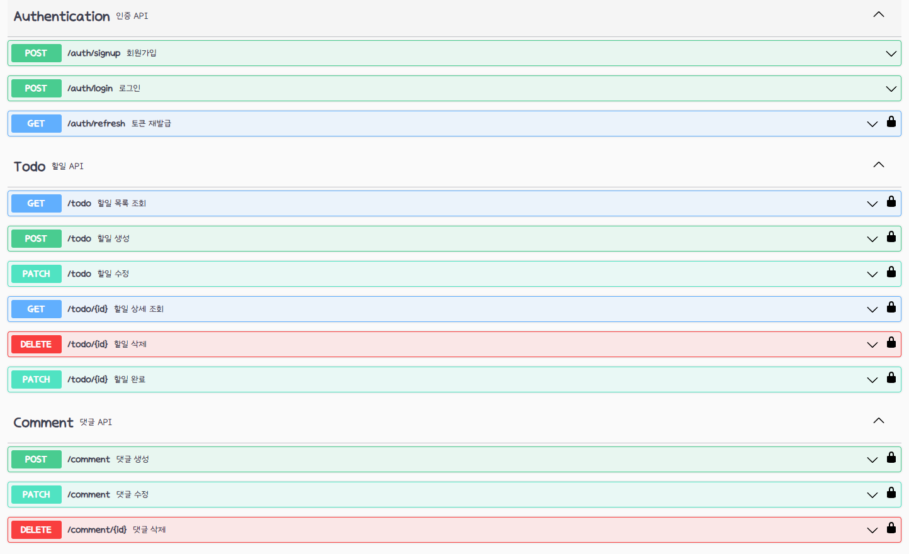

## Goal
"회원가입, 로그인 기능이 있는 투두앱 백엔드 서버 만들기"

[요구사항 문서](./과제요구사항.md)

## ERD

## API

## Why?
1. 처음 설계한 API 명세서에 변경사항이 있었나요?
   변경되었다면 어떤 점 때문 일까요? 첫 설계의 중요성에 대해 작성해 주세요!

> 할일 상세 조회 기능의 변경 사항이 있었어요. 
> 생성된 댓글에 대한 데이터를 조회하는 기능이 없어서 생성된 댓글을 조회할 수가 없었어요.
> 그래서 할일 상세 조회 기능에 생성된 댓글을 조회하는 기능을 추가 구현하면서 명세서가 변경되었어요.
> 
> 설계가 변경되면 코드 상에서 영향이 크기 때문에 쉽게 바꾸기가 힘들다고 느꼈어요.
> 그래서 최대한 가능하면 첫 설계에서 변경 사항을 최소화하는 것이 좋다고 생각했어요.
> 변경이 생기면 유연하게 처리할 수 있도록 설계 상에서 결합을 최소화하는 노하우도 필요하다는 생각도 했어요!!

2. ERD를 먼저 설계한 후 Entity를 개발했을 때 어떤 점이 도움이 되셨나요?

> 요구사항에서 파악된 도메인에서 필요한 속성을 미리 ERD로 도식화한 이후에 개발을 하니까
> Entity 개발할 때, 필요한 속성을 정확하고 빠르게 구현할 수 있어서 편했어요!
> 개발한 Entity의 관계를 ERD를 통해서 한눈에 파악하기 수월했어요.

3. JWT를 사용하여 인증/인가를 구현 했을 때의 장점은 무엇일까요?
> 1. 상태 관리를 하지 않는다.
> 2. 서버의 수평 확장이 자유롭다.

4. 반대로 JWT를 사용한 인증/인가의 한계점은 무엇일까요?
> 1. 중요한 정보를 토큰에 담을 수 없다.
> 2. 토큰이 탈취당하면 대처가 어렵다.

5. 만약 댓글이 여러개 달려있는 할일을 삭제하려고 한다면 무슨 문제가 발생할까요? Database 테이블 관점에서 해결방법이 무엇일까요?
> N + 1 문제에 노출될 가능성이 있기 때문에 삭제 쿼리를 커스텀해야한다고 생각해요.

6. IoC / DI 에 대해 간략하게 설명해 주세요!
> IOC
> 제어의 역전이라는 뜻으로 프로그램의 흐름을 프레임워크가 처리해주는 것

> DI
> 의존성 주입이라는 뜻으로 객체 생성시 필요한 속성을 외부에서 주입해주는 것